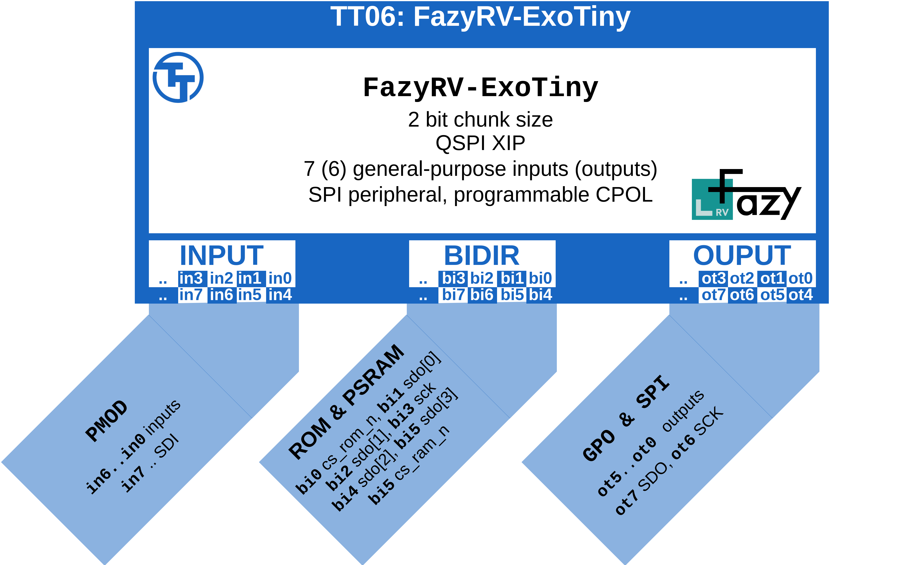
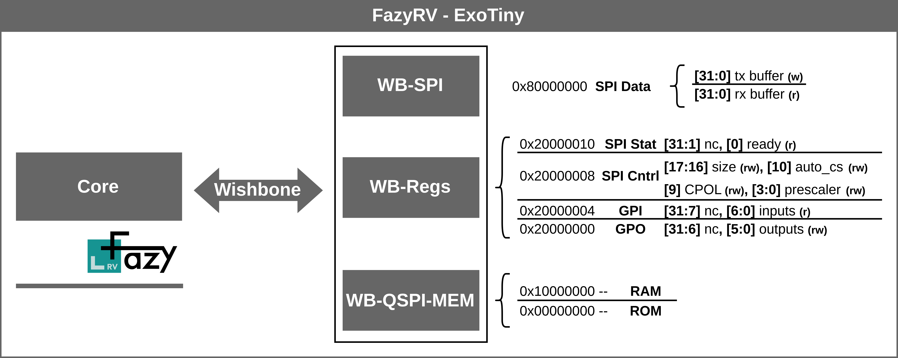

  

# TT06: FazyRV-ExoTiny

This TinyTapeout implements a System-on-Chip (SoC) design based on the FazyRV RISC-V core. Within this repository, all workflows and port bindings for TT06 are located. Documentation on the SoC can be found in [meiniKi/FazyRV-ExoTiny](https://github.com/meiniKi/FazyRV-ExoTiny). For details on the FazyRV core, please refer to [meiniKi/FazyRV](https://github.com/meiniKi/FazyRV).

<p align="center">
  
</p>


* Instantiates FazyRV with a chunk size of 2 bits.
* Uses external instruction memory (QSPI ROM) and external data memory (QSPI RAM).
* Provides 6 memory-mapped general-purpose outputs and  7 inputs.
* Provides an SPI peripheral with programmable CPOL and a buffer of up to 4 bytes.


| Pin       | Description | Note        |
| --------- | ----------- | ----------- |
| **clk**   | Clock       | up to 50MHz |
| **rst_n** | Reset       | low active  |


## Pin Description

| Pin             | Description             | Reset State           |
| --------------- | ----------------------- | --------------------- |
| **in6 ... in0** | General purpose inputs  | high-z                |
| **in7**         | (User) SPI SDI          | high-z                |
| **bi0**         | CS ROM (low active)     | high-z                |
| **bi1**         | (Memory) QSPI SDIO0     | high-z                |
| **bi2**         | (Memory) QSPI SDIO1     | high-z                |
| **bi3**         | (Memory) QSPI SCK       | high-z                |
| **bi4**         | (Memory) QSPI SDIO2     | high-z                |
| **bi5**         | (Memory) QSPI SDIO3     | high-z                |
| **bi6**         | CS RAM (low active)     | high-z                |
| **bi7**         | NC                      | high-z                |
| **ot5 ... ot0** | General purpose outputs | 0 (low)               |
| **ot6**         | (User) SPI SCK          | 0/1 depending on CPOL |
| **ot7**         | (User) SPI SCK          | 0 (low)               |

## Memory Map and SoC Description



Further documentation can be found at [meiniKi/FazyRV-ExoTiny](https://github.com/meiniKi/FazyRV-ExoTiny).

## Quick Start

### Run Preprocessing

```shell
mkdir build
yosys -s synth/tt.ys
```