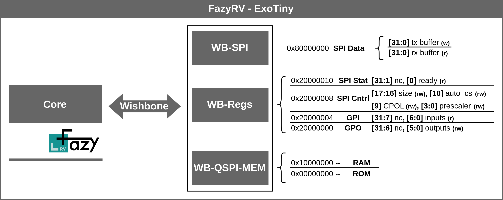

  

# TT06: FazyRV-ExoTiny

This TinyTapeout implements a System-on-Chip (SoC) design based on the FazyRV RISC-V core. Within this repository, all workflows and port bindings for TT06 are located. Documentation on the SoC can be found in [meiniKi/FazyRV-ExoTiny](https://github.com/meiniKi/FazyRV-ExoTiny). For details on the FazyRV core, please refer to [meiniKi/FazyRV](https://github.com/meiniKi/FazyRV).

<p align="center">
  
</p>


* Instantiates FazyRV with a chunk size of 2 bits.
* Uses external instruction memory (QSPI ROM) and external data memory (QSPI RAM).
* Provides 6 memory-mapped general-purpose outputs and  7 inputs.
* Provides an SPI peripheral with programmable CPOL and a buffer of up to 4 bytes.


| Pin       | Description | Note        |
| --------- | ----------- | ----------- |
| **clk**   | Clock       | up to 50MHz |
| **rst_n** | Reset       | low active  |

> [!IMPORTANT]  
> `rst_n` is not synchronized. Make sure it is released sufficient hold time after the rising clock edge and sufficient setup time before the falling edge. Do not release reset while `clk` is low. The design appears to be on the edge of implementability. An additional dff breaks convergence.


## Pin Description

| Pin             | Description             | Reset State           |
| --------------- | ----------------------- | --------------------- |
| **in6 ... in0** | General purpose inputs  | high-z                |
| **in7**         | (User) SPI SDI          | high-z                |
| **bi0**         | CS ROM (low active)     | high-z                |
| **bi1**         | (Memory) QSPI SDIO0     | high-z                |
| **bi2**         | (Memory) QSPI SDIO1     | high-z                |
| **bi3**         | (Memory) QSPI SCK       | high-z                |
| **bi4**         | (Memory) QSPI SDIO2     | high-z                |
| **bi5**         | (Memory) QSPI SDIO3     | high-z                |
| **bi6**         | CS RAM (low active)     | high-z                |
| **bi7**         | NC                      | high-z                |
| **ot5 ... ot0** | General purpose outputs | 0 (low)               |
| **ot6**         | (User) SPI SCK          | 0/1 depending on CPOL |
| **ot7**         | (User) SPI SCK          | 0 (low)               |

## Memory Map and SoC Description



Further documentation can be found at [meiniKi/FazyRV-ExoTiny](https://github.com/meiniKi/FazyRV-ExoTiny).

## Quick Start

## Init the Repo

```shell
git submodule update --init --recursive
```

### Run Preprocessing

```shell
make preproc
```

### Run Simulation

```shell
make sim
```

The `sim` target builds the risc-v tests in `FazyRV-ExoTiny/sim/firmware` and executes them on the pre-processed SoC design and the testbench in `tb`.


### Run Cocotb Simulation

```shell
make sim.cocotb.default
# or
make sim.cocotb.gl
# to run gate level simulation. Needs gate_level_netlist.v to be copied to `test` 
```

The cocotb simulation is designed to also work with the post-synthesized design. Thus, it provides less debugging information and is only recommended to be used after `make sim` passes.

